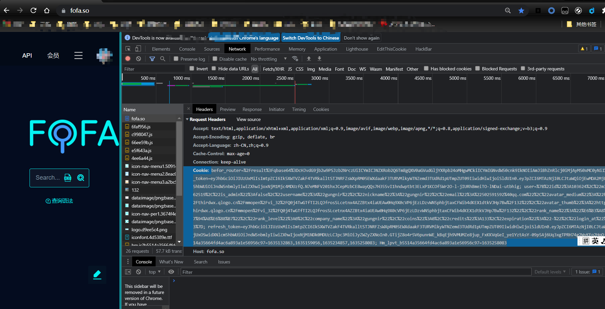
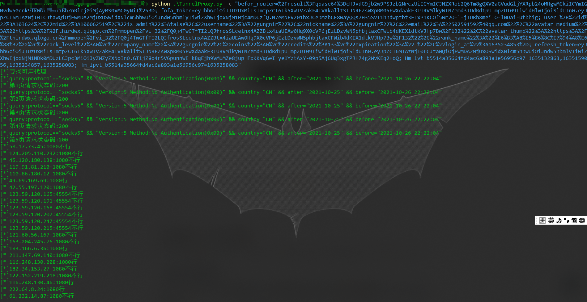
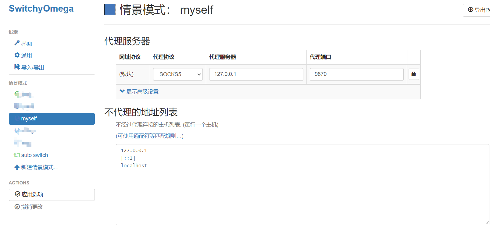

# TunnelProxy

是一个本地隧道代理，可以从fofa爬取免费的socks代理，然后构建代理池，如果一个代理失效，会自动切换。

## 应用场景

渗透测试需要访问某些国内网站（比如edu的），想要隐藏自己，但是国外代理不能访问，也没有稳定的可用代理的时候。

之后，可能我会增加国外代理，实现白嫖科学上网。。。（目前还没弄

## Need

```
python3
pip install requests
pip install pysocks
```

## HowToUse

三个参数

```
-a : 时间范围搜索socks5代理，搜索某时间之后的资源，格式 2021-10-25 10:00:00，如果有具体时间，需要加引号
-b : 时间范围搜索socks5代理，搜索某时间之前的资源，格式 2021-10-25 10:00:00，如果有具体时间，需要加引号
-c : 先去fofa登录，把cookie复制下来，不然只能请求一页代理，代理池会很小
```

在运行之前，需要先去fofa登录，拿到cookie，因为fofa登陆过后，能爬取5页，能得到更多白嫖的代理。（没钱好痛苦😥

复制之后，运行

```
python TunnelProxy.py -c You-Cookie
```

默认爬取的代理时间为前一天到现在的时间的。

如果爬取效果不理想，可以通过-a和-b来调整时间。

时间样例：2021-10-25 10:00:00

```
python TunnelProxy.py -a "2021-10-25 10:00:00" -b "2021-10-26" -c You-Cookie
```


在运行之后，等程序爬取完代理，找出可用代理，会监听本地9870端口。（如果想改变监听端口，可以在程序的main中自行改变port。）

等到程序监听9870端口，就可以配合浏览器插件SwitchyOmega，让他把浏览器流量都转发给本地9870端口，这时候，我们就可以愉快走着免费代理，隐匿自己探索国内一些网站。

